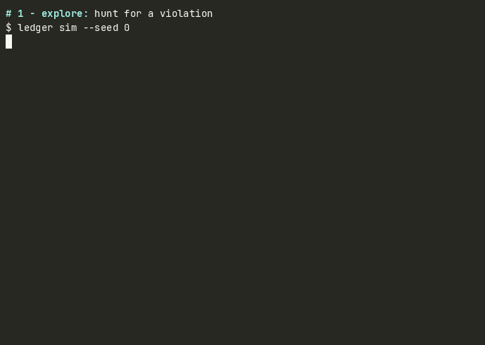

<div align="center">
  <picture>
    <source media="(prefers-color-scheme: dark)" srcset="docs/assets/logo-lockup-dark.svg">
    
  </picture>
</div>

[](https://github.com/ldgr-rs/ldgr/actions/workflows/ci.yml)
[](https://github.com/ldgr-rs/ldgr/actions/workflows/corpus-gate.yml)
[](https://github.com/ldgr-rs/ldgr/actions/workflows/wasm-polyglot.yml)
[](https://github.com/ldgr-rs/ldgr/actions/workflows/format-conformance.yml)
[](#license)

**ldgr** (short for *ledger*) is an open-source deterministic simulation
testing engine. Your distributed system runs against a simulated world. Every
effect lands in a causal DAG journal. When something breaks, ldgr hands you
the smallest reproduction, with a certificate you can check.

<div align="center">
  
</div>

Four commands, one story: explore hunts down a violation, replay proves the
journal root is byte-identical across runs, LDFI explains which faults caused
it, and minimize hands you a one-decision counterexample. Every step above is
the unedited output of the commands shown.

## Why

Concurrency bugs found in production are expensive twice: once when they page
you, and again when nobody can reproduce them. Chaos engineering breaks things
in ways you cannot replay. Property tests shrink inputs, not interleavings.

A deterministic engine makes the bug boring. Same seed in, same bytes out,
forever. You debug once, on your laptop, at your own pace.

## The name and mark

ldgr is "ledger" typed without vowels - the way you scribble it on a whiteboard
next to an architecture diagram. It stuck because a journaling tool ought to
have a name that is fast to type.

The mark is a canonical four-node causal diamond DAG: one genesis seed root
forks to two concurrent effects that converge back into a verified journal root.

## Bugs travel as files

Every finding compiles to a `.ldgr` manifest: the seed, the schedule, and the
canonical CBOR history, content-addressed by hash. Our whole regression corpus
is 16 planted bugs and not one of them is bigger than 261 bytes:

```sh
$ wc -c corpora/bug-corpus-v1/mini-kv-stale-read.ldgr
225 corpora/bug-corpus-v1/mini-kv-stale-read.ldgr
```

Attach it to a GitHub issue. Anyone with ldgr replays your exact bug on their
machine - same journal root, same violation, no flaky reruns - and verifies
the artifact in one command:

```sh
$ ledger format corpora/bug-corpus-v1/mini-kv-stale-read.ldgr --check
[ok] corpora/bug-corpus-v1/mini-kv-stale-read.ldgr: canonical
```

A core dump for distributed systems, minus the gigabytes. The format is
canonical RFC 8949 CBOR, checked against a Go reference implementation, and
free forever. Longer term these artifacts get a public home: **ldgrhub**, a
registry where findings are browsed by protocol class and replayed live in
your browser. It is on the [roadmap](ROADMAP.md); the
file format above is its foundation.

## Quickstart

Rust 1.90 or newer (1.97 pinned via `rust-toolchain.toml`):

```sh
git clone https://github.com/ldgr-rs/ldgr && cd ldgr
cargo run -p ledger-cli -- sim
```

From there:

```sh
cargo run -p ledger-cli -- repro <manifest>    # replay a finding exactly
cargo run -p ledger-cli -- minimize <manifest> # shrink it further
cargo run -p ledger-cli -- cert <manifest>     # emit an audit certificate
cargo run -p ledger-cli -- --json sim          # machine-readable everywhere
```

Subcommands: `sim`, `repro`, `minimize`, `diff`, `ldfi`, `faults`, `cert`,
`coverage`, `ingest`, `format`, `scaffold`, `init`, `doctor`, `completions`.
A hidden `rt-server` backs the [ldgr-rt](crates/ldgr-rt) IPC facade.

## What you get

- **A causal journal, not a log file.** Every simulated effect lands in a
  content-addressed DAG. Replay is byte-identical, forks share prefixes, and
  runs diff entry by entry. Append throughput measures around 1.5 million
  entries per second per core; the CI gate floor is 1 million.
- **Lineage-driven fault injection (LDFI).** Instead of rolling dice over the
  fault space forever, the explorer reads lineage backward from the failure
  and targets faults that could have caused it. On gate legs it finds seeded
  bugs well above the 5x efficiency floor we assert.
- **Minimized counterexamples with certificates.** Findings shrink by at
  least 90 percent even at a million journal entries, and each reduction
  ships with a checkable certificate.
- **Deterministic everything.** Virtual time, seeded RNG streams, simulated
  filesystem and network, single-threaded cooperative scheduling. CI runs
  campaigns twice and compares journal roots to prove it.
- **Native and Wasm parity.** Port your system once as a `wasm32-wasip1`
  guest; differential gates assert byte-identical behavior against native.
- **An ambient-API tripwire.** `ledger-lint` fails the build when simulation
  code reads wall clocks, OS randomness, threads, or real I/O. Determinism
  stops being a convention and becomes a compile error.
- **A planted-bug corpus.** 16 known-buggy fixtures across consensus,
  crash-consistency, and cloud-infrastructure failures, each under 261
  bytes. Each is a gate: the engine must find it, reproduce it, and shrink
  it.
- **Findings are portable artifacts.** The `.ldgr` manifest carries seed,
  schedule, and history; `format --check` verifies canonical encoding, and
  anyone can replay your bug byte-identically without your machine.

## How it compares

| | deterministic replay | fault injection | auto-minimized repro | open, self-hosted |
| --- | --- | --- | --- | --- |
| property testing (`proptest`, hypothesis) | inputs only | no | shrinks inputs, not schedules | yes |
| madsim | tokio primitives | random | no | yes |
| Jepsen | no (real clusters) | yes | manual analysis | service |
| Antithesis | hypervisor level | yes | yes | closed SaaS |
| **ldgr** | effect-journal level | targeted (LDFI) + random | yes, certified | yes, Apache/AGPL |

These solve different problems and many teams use several. The table exists
so you can place ldgr in thirty seconds.

## How it fits together

```text
 your SUT ──► ledger-rt (Apache facade) ──► effects boundary
   wasm guest ────────────────────────────────┘      │
                                                    ▼
        faultspec (scenarios) ──► ledger-sim (simulated world)
                                        │ journals effects
                                        ▼
                              ledger-journal (causal DAG)
                                        │ evidence
                                        ▼
        ledger-explorer (search, LDFI, minimizer, certificates)

  ledger-cli ties it together; ledger-worker runs campaigns over UDS/gRPC;
  ledger-adapters turns OpenTelemetry spans into journal envelopes.
```

Dependencies point inward toward format and journal. The wire format is
canonical CBOR, kept byte-identical against a Go reference implementation by
a conformance suite.

## Rules inside a simulation

Never read the ambient wall clock, call OS random generators, spawn OS
threads, or do raw file or network I/O. Route those through `Effects`:
virtual time, seeded streams, simulated net and fs. `ledger-lint` enforces
this mechanically, with explicit allow markers at host boundaries.

## Development gates

```sh
cargo fmt --all -- --check
cargo clippy --workspace --all-targets --all-features -- -D warnings
cargo nextest run --workspace --all-features --profile ci
cargo test --workspace --doc
cargo run -p ledger-lint -- crates/
cargo run -p xtask -- licenses        # license split + boundary architecture
```

Wasm work also needs the guest built first:
`cargo build --target wasm32-wasip1 -p wasm-guest`.

## Honest status

Works today, gated in CI: the journal and its crash-recovery semantics, the
simulator and both backends, LDFI campaigns, minimization with certificates,
the corpus gates, OTel ingest, the worker protocol over UDS and gRPC, and the
CLI surface above.

If a claim here ever drifts from reality, treat this file as wrong and open an issue.
separate benchmarks and use cases etc will be uploaded later.

## License

Three layers, on purpose:

| Layer | Crates | License |
| --- | --- | --- |
| Contracts and codecs | `ledger-format`, `ledger-journal`, `wasm-guest` | MIT OR Apache-2.0 |
| Engine | `ledger-sim`, `ledger-explorer` | AGPL-3.0-or-later, commercial license available |
| Tooling | CLI, worker, adapters, rt, lint, flow, faultspec | Apache-2.0 |

Embed the contracts freely. Use the engine openly under AGPL, including
commercially; if section 13 does not fit your deployment, ask about the
commercial license. See [CONTRIBUTING.md](CONTRIBUTING.md) and the LICENSE
files. `xtask licenses` enforces the split in CI.

## Trademark

The name ldgr and the project branding are trademarks of the ldgr maintainers
(see [NOTICE](NOTICE)). Forks are welcome under the licenses above; please
rename yours.

## Contributing

Issues and pull requests welcome. Start with
[CONTRIBUTING.md](CONTRIBUTING.md); engine contributions carry a DCO sign-off
plus the inbound grant that keeps dual licensing possible.
